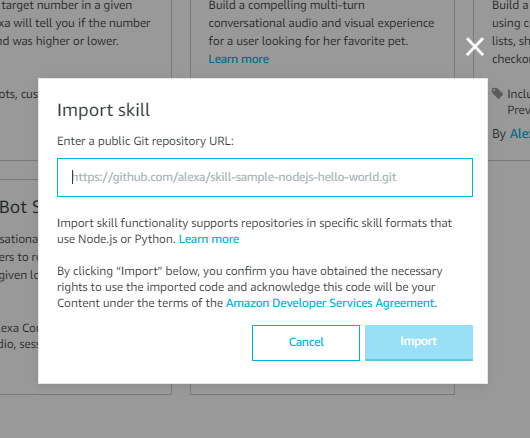
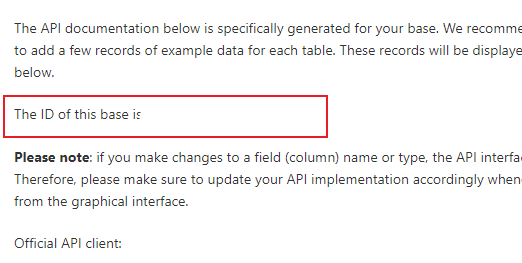

## Meal Planner 

This Alexa Skill Template allows you to plan your meals and ask for suggestions on what to cook. 
For this skill to work, You will require 
1. [An Amazon Developer Account](https://developer.amazon.com/)
2. [An Airtable Account](https://airtable.com/invite/r/henbCQON)
3. [An Airtable Base that looks like this](https://airtable.com/shrVv5h43q73fgPzl)

## Features

Once you have setup the Skill, you can ask the skill the following things : 

### Ask for a Suggestion 
User : Alexa, ask meal planner for a breakfast / lunch / dinner suggestion. 
Alexa : <Gives a suggestion for breakfast/lunch/dinner from your Airtable Dishes List>

User : Alexa, ask meal planner for a breakfast that {name} likes. 
Alexa : <Gives a suggestion from your Dishes table. The Name is picked up from the Favorites Column.>

### Set your Weekly Plan and ask what you are cooking 
User : Alexa, open meal planner
Alexa : Welcome to Meal Planner. What would you like to do? 
User : Set My Meal
Alexa : <Sets your meal.>

USer : Alexa, open meal planner
Alexa : Welcome to Meal Planner. What would you like to do?
User : What am I cooking today?
Alexa : From your Meal Plan, you are cooking xx for breakfast, yy for lunch and zz for Dinner. 

## Installation 

1. Once you have registered for an Amazon Developer Account, head over to the [Alexa Developer Console](https://developer.amazon.com/alexa/console/ask).

2. Click on Create Skill Button

3. On the page that comes up,
    *   Enter __Meal Planner__ as the Skill Name. 
    *   Choose the Default Language. Only __English__ is supported for now. 
    *   In the Choose a model to add to your skill section, Choose __Custom__
    *   In the Choose a method to host your skill's backend resources, Choose __Alexa-Hosted (Node.js)__
    *   Click on the __Create Skill__ Button.

4. On the next page, click on the Import Skill Button and in the URL field, enter the URL of this repository. i.e [https://github.com/pkarthikr/alexa-meal-planner-skill.git](https://github.com/pkarthikr/alexa-meal-planner-skill.git) and click on Import. 

5. Once the skill has been created, click on the Code Section at the top to access your Skill's Backend Logic. On this page, open the config.js file. 

6. You will need your [Airtable API Key](https://airtable.com/account) and the Base ID.

7. To get the Base ID, open your Airtable Base and click on Help in the Top Right Corner and click on API Documentation. Get the ID from the Documentation page. 

8. Populate Dishes in the Dishes tab of your Airtable Base. Alexa's Meal Planner will help you suggest a random dish whenever you say "Alexa, ask meal planner for a "dinner" suggestion".

ToDo : 

1. Determine if the user has set the plan for the week, and if not tell them about setting a meal plan. 
2. Handle Utterances like what am I cooking today for {current Meal}
2. Handle Multi Value Slots so we can ask what am I cooking with Capsicum and Onions? 

Alexa, ask meal planner what am I cooking today?
Alexa, ask meal planner what am I cooking today for dinner? 
Alexa, ask meal planner, what is going to be my next meal? 
Alexa, ask meal planner, what am I cooking now? 

Alexa, ask meal planner what can I cook with capsicum and onions (< Multi Value Slots, so will work for only English locales (Except IN) for this moment>)

Happy Path Conversation 

U : Alexa, Open Meal Helper
A : Welcome to the Meal Helper! It looks like you do not have a meal plan set. 
You can ask me to set your weekly meal plan or you can just ask for {meal} suggestions. 

5 AM - 10 AM : Breakfast 
10 AM - 3 PM : Lunch
3 PM onwards : Dinner 